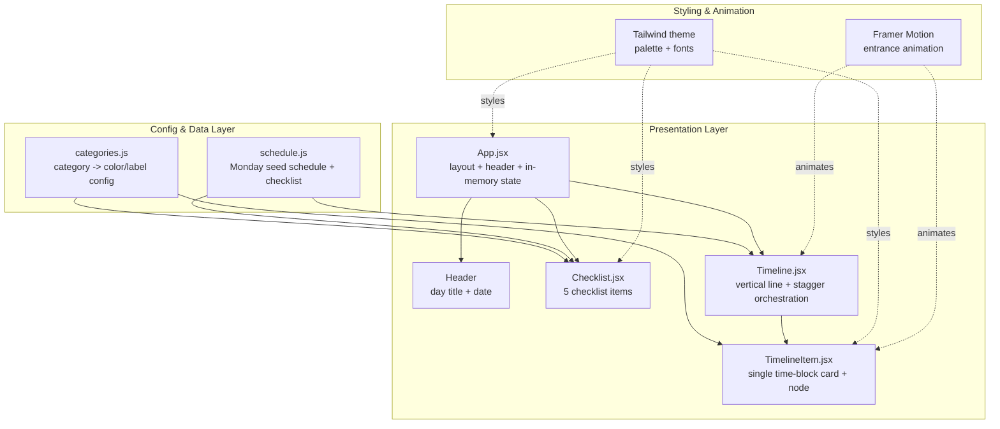

# Design Document: Daily Routine Dashboard

## Overview

The Daily Routine Dashboard is a personal, single-user web app that renders a software
student's daily routine as a warm, characterful **vertical timeline** rather than a generic
dashboard grid. This step (STEP 1) establishes the foundation — the Vite + React + Tailwind +
Framer Motion project, a shared design system (palette, fonts, category accents), and one fully
working, polished, animated day view for **Monday ("Dev & Creator Day")**.

The experience is intentionally opinionated toward daily feel: a deep-indigo canvas, glowing
category-colored nodes strung along a single vertical line, a serif voice for titles, and a
staggered entrance animation so the day "unfolds" on load instead of snapping into place.

All state in this step lives in memory via `useState`. There is no persistence, no
day-switching, and no notifications — those are explicitly deferred to future steps (see
[Out of Scope](#out-of-scope--future-work)). The architecture is split into small, composable
components and a central data/config module so those later steps can extend the app without a
rewrite.

## Architecture

The app is a single-page React application. A central configuration module owns the design
system tokens (category → color mapping), a data module owns Monday's seed schedule and checklist,
and presentation components consume both. There is no global state manager — light in-memory
`useState` in `App` is sufficient for this step.



### Project Structure

```
daily-routine-dashboard/
├── index.html
├── package.json
├── vite.config.js
├── tailwind.config.js
├── postcss.config.js
└── src/
    ├── main.jsx                 # React entry, mounts <App/>
    ├── index.css                # Tailwind directives + Google Font imports
    ├── App.jsx                  # top-level layout, header, state
    ├── config/
    │   └── categories.js        # single source of truth for category accents
    ├── data/
    │   └── schedule.js          # Monday schedule + checklist seed data
    └── components/
        ├── Checklist.jsx        # daily checklist card (5 items)
        ├── Timeline.jsx         # vertical timeline container + stagger
        └── TimelineItem.jsx     # one time-block card with node
```

### Rationale

- **Central config (`categories.js`)** keeps the accent-color system defined in exactly one
  place, so adding a category or retheming later touches one file.
- **Central data (`schedule.js`)** separates content from presentation. When day-switching
  arrives, this module becomes a keyed collection of days without changing components.
- **`Timeline` vs `TimelineItem` split** isolates line/stagger orchestration from the rendering
  of a single card, which keeps `TimelineItem` a pure presentational unit that later steps can
  enhance (e.g., "current time" logic, click-to-expand).
- **No persistence / no router** now avoids premature abstraction while leaving clear seams.

## Design System

The design system is expressed as Tailwind theme extensions so every component references named
tokens instead of raw hex values.

### Color Palette

| Token | Hex | Usage |
|-------|-----|-------|
| `indigo.deep` | `#1E1B4B` | App background |
| `indigo.surface` | `#2E2A5E` | Card surfaces |
| `faith` | `#D4A937` | Faith category (gold) |
| `career` | `#0F766E` | Career category (teal) |
| `health` | `#65A30D` | Health category (sage) |
| `language` | `#E11D48` | Language category (rose) |
| `life` | `#94A3B8` | Life / Rest category (slate) |

Note: **Life** and **Rest** share the slate accent (`#94A3B8`). `Rest` is treated as an alias of
the `life` visual family so the palette stays at five accents while schedule data can still label
a block "Rest".

### Typography

- **Serif (titles + section headers):** Fraunces (primary) with Lora fallback, loaded via Google
  Fonts. Mapped to Tailwind `font-serif`.
- **Sans-serif (body + timeline text):** Inter, loaded via Google Fonts. Mapped to Tailwind
  `font-sans`.

### Tailwind Theme Extension (design intent)

```js
// tailwind.config.js (extend block)
theme: {
  extend: {
    colors: {
      indigo: { deep: '#1E1B4B', surface: '#2E2A5E' },
      faith:    '#D4A937',
      career:   '#0F766E',
      health:   '#65A30D',
      language: '#E11D48',
      life:     '#94A3B8',
    },
    fontFamily: {
      serif: ['Fraunces', 'Lora', 'serif'],
      sans:  ['Inter', 'system-ui', 'sans-serif'],
    },
  },
}
```

### Signature Visual: Vertical Timeline

- A single vertical line runs down the left side of the schedule column.
- Each schedule entry is a **card** offset to the right of the line.
- Each card has a small **node** (circle) sitting on the line, filled with the entry's category
  color.
- A soft **glow/dot** marks where "current time" would sit on the line. In this step it renders at
  a static, illustrative position (no live clock logic yet); the seam is designed so a future step
  can compute it from the current time.

## Components and Interfaces

### Config: `categories.js`

**Purpose:** Single source of truth mapping each category to its display label and accent color.

```js
// config/categories.js
export const CATEGORIES = {
  Faith:    { label: 'Faith',    color: '#D4A937', token: 'faith' },
  Career:   { label: 'Career',   color: '#0F766E', token: 'career' },
  Health:   { label: 'Health',   color: '#65A30D', token: 'health' },
  Language: { label: 'Language', color: '#E11D48', token: 'language' },
  Life:     { label: 'Life',     color: '#94A3B8', token: 'life' },
  Rest:     { label: 'Rest',     color: '#94A3B8', token: 'life' }, // alias of Life family
}

// Resolve a category key to its config, falling back to a neutral default.
export function getCategory(key) { /* returns CATEGORIES[key] or a safe default */ }
```

**Responsibilities:**
- Own the category → color/label mapping.
- Provide a safe resolver so an unknown category never crashes rendering.

### Data: `schedule.js`

**Purpose:** Owns Monday's metadata, the timeline schedule, and the checklist seed data.

```js
// data/schedule.js
export const MONDAY = {
  id: 'monday',
  title: 'Monday — Dev & Creator Day',
  schedule: [ /* ScheduleEntry[] — see Data Models */ ],
  checklist: [ /* ChecklistItem[] — see Data Models */ ],
}
```

**Responsibilities:**
- Provide immutable seed data for the Monday view.
- Keep shape stable so day-switching later becomes a keyed map of this shape.

### `App.jsx`

**Purpose:** Top-level layout, header, and in-memory state holder.

```jsx
function App(): JSX.Element
```

**Responsibilities:**
- Render the responsive page shell on the deep-indigo background.
- Render the header: serif day title `"Monday — Dev & Creator Day"` + today's date.
- Hold checklist checked-state in memory (`useState`) and pass it down.
- Compose `<Checklist />` and `<Timeline />`.

### `Header` (rendered within `App.jsx`)

**Purpose:** Display the day name and today's date.

**Responsibilities:**
- Render day title in `font-serif`.
- Render today's date (formatted from `new Date()`), in `font-sans`.

### `Checklist.jsx`

**Purpose:** Render the "Daily Checklist" card with 5 items, each with a category-colored
checkbox.

```jsx
function Checklist({ items, checkedState, onToggle }): JSX.Element
```

**Responsibilities:**
- Render a card surface header ("Daily Checklist") in the serif font.
- Render each item with a checkbox tinted by its category color and a text label.
- Reflect checked/unchecked state visually and call `onToggle(id)` on interaction.

### `Timeline.jsx`

**Purpose:** Render the vertical line, orchestrate the staggered entrance, and map schedule
entries to items.

```jsx
function Timeline({ schedule }): JSX.Element
```

**Responsibilities:**
- Render the continuous vertical line and the "current time" glow marker (static position).
- Wrap items in a Framer Motion container that staggers children on load.
- Map each `ScheduleEntry` to a `<TimelineItem />`.

### `TimelineItem.jsx`

**Purpose:** Render one time-block card with its node and category styling.

```jsx
function TimelineItem({ entry }): JSX.Element
```

**Responsibilities:**
- Render the node (circle) filled with the entry's category color.
- Render a card showing time range, colored category label, and description.
- Apply the per-item fade + slide entrance variant (stagger controlled by parent).

## Data Models

### `ScheduleEntry`

```js
/**
 * @typedef {Object} ScheduleEntry
 * @property {string} id          - stable unique key (e.g. "0440-0530")
 * @property {string} start       - 24h start time "HH:MM"
 * @property {string} end         - 24h end time "HH:MM"
 * @property {string} category    - one of the keys in CATEGORIES
 * @property {string} description - human-readable block description
 */
```

**Validation Rules:**
- `start` and `end` match `HH:MM` (00:00–23:59).
- `category` is a key present in `CATEGORIES`.
- `description` is a non-empty string.
- `id` is unique across the schedule array.

### `ChecklistItem`

```js
/**
 * @typedef {Object} ChecklistItem
 * @property {string} id        - stable unique key
 * @property {string} label     - display text (may include time hint)
 * @property {string} category  - one of the keys in CATEGORIES
 */
```

**Validation Rules:**
- `category` is a key present in `CATEGORIES`.
- `label` is a non-empty string.
- `id` is unique across the checklist array.

### Monday Seed Schedule

| id | start | end | category | description |
|----|-------|-----|----------|-------------|
| 0440-0530 | 04:40 | 05:30 | Faith | Wake up, Wudu & Fajr Prayer |
| 0530-0620 | 05:30 | 06:20 | Health | Gym & Fitness |
| 0620-0730 | 06:20 | 07:30 | Life | Breakfast & Tidy Environment |
| 0730-1130 | 07:30 | 11:30 | Career | Deep Work: React, SQL & AI Engineering Projects |
| 1130-1230 | 11:30 | 12:30 | Faith | Lunch & Dhuhr Prayer (12:06 PM) |
| 1230-1300 | 12:30 | 13:00 | Rest | Screen-free break |
| 1300-1530 | 13:00 | 15:30 | Career | YouTube / Online Income Research & Content Creation |
| 1530-1730 | 15:30 | 17:30 | Faith | Asr Prayer (3:30 PM) & Free Time |
| 1730-1825 | 17:30 | 18:25 | Life | Dinner |
| 1825-1830 | 18:25 | 18:30 | Faith | Maghrib Prayer |
| 1830-2000 | 18:30 | 20:00 | Language | Chinese Class (Beginner) |
| 2000-2030 | 20:00 | 20:30 | Faith | Isha Prayer (7:46 PM) & Family Time |
| 2030-2130 | 20:30 | 21:30 | Career | Tech Podcasts, Senior Dev Workflows, AI Tutorials |
| 2130-2230 | 21:30 | 22:30 | Life | Wind down, skincare, read Atomic Habits |
| 2230-0440 | 22:30 | 04:40 | Health | Sleep |

### Monday Checklist Seed

| id | label | category |
|----|-------|----------|
| chk-fajr | Fajr Prayer (4:40 AM) | Faith |
| chk-read | Read Atomic Habits (10 pages) | Life |
| chk-clean | Clean Room & Desk (Morning) | Life |
| chk-noscroll | Zero Mindless Social Media Scrolling | Life |
| chk-gym | Gym / Workout | Health |

## Animation Design

- **Timeline entrance:** The `Timeline` acts as a Framer Motion `variants` container with
  `staggerChildren` (~0.08s) so cards enter one after another, not simultaneously.
- **Per-item variant:** each `TimelineItem` animates from `{ opacity: 0, y: 16 }` (or slight
  x-offset) to `{ opacity: 1, y: 0 }` with a short ease-out transition.
- **Reduced motion:** honor `prefers-reduced-motion`; when set, items appear without transform to
  respect accessibility.

## Responsive Design

- **Laptop:** timeline column centered with comfortable max width; checklist card above the
  timeline (or alongside per layout), generous spacing.
- **Phone:** single-column stack; timeline line and nodes remain on the left with cards filling
  available width; font sizes and paddings scale down via Tailwind responsive utilities.
- Layout uses Tailwind responsive breakpoints (`sm`, `md`, `lg`) rather than fixed pixel widths.

## Error Handling

### Unknown Category

**Condition:** A schedule/checklist entry references a category not in `CATEGORIES`.
**Response:** `getCategory` returns a neutral default (slate) with the raw key as label.
**Recovery:** Rendering continues; no crash.

### Empty Schedule / Checklist

**Condition:** The schedule or checklist array is empty.
**Response:** Timeline renders the bare line with no items; checklist renders its header with no
rows.
**Recovery:** UI remains stable and readable.

## Testing Strategy

### Unit Testing Approach

- Test `getCategory` resolution: known keys return correct color/label; unknown keys return the
  safe default; the `Rest` alias resolves to the slate/life family.
- Test that `Checklist` toggling flips the visual checked state for the targeted item only.
- Test rendering of a `TimelineItem` includes time range, category label, and description text.

### Property-Based Testing Approach

Pure, input-driven functions are the targets for property tests: category resolution and the
formatting/rendering of entries. UI feel and layout are validated by example tests, not
properties.

**Property Test Library:** fast-check (with Vitest + React Testing Library).

### Integration Testing Approach

- Render `<App />` and assert the header shows the serif title and a date, the checklist shows 5
  items, and the timeline renders one card per schedule entry (15 cards).

## Correctness Properties

*A property is a characteristic or behavior that should hold true across all valid executions of a
system — essentially, a formal statement about what the system should do. Properties serve as the
bridge between human-readable specifications and machine-verifiable correctness guarantees.*

_Properties will be finalized and mapped to requirements after the requirements phase._

## Dependencies

- **vite** — build tool / dev server
- **react**, **react-dom** — UI runtime (functional components + hooks only)
- **tailwindcss**, **postcss**, **autoprefixer** — styling with theme extensions
- **framer-motion** — entrance animation
- **Google Fonts** — Fraunces/Lora (serif) and Inter (sans), loaded via `index.css`/`index.html`
- _Dev/test (optional):_ **vitest**, **@testing-library/react**, **fast-check**

## Out of Scope / Future Work

The following are explicitly **not** part of this step and are noted here as future work:

- **Day-switching UI** — Monday only, hardcoded seed data. The `schedule.js` shape is designed so
  days can later become a keyed collection.
- **Notifications** — no reminders/alerts of any kind in this step.
- **Backend, database, or persistence** — all state is in-memory via `useState`; checklist state
  resets on reload by design.
- **Live "current time" marker** — the glow/dot renders at a static illustrative position; live
  clock computation is deferred.
