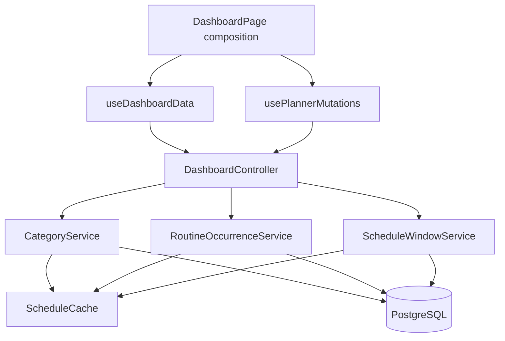

# Design: Planner Personalization, Routine Streaks, and Upcoming Schedule

**Status:** Approved on September 20, 2026  
**Requirements:** `requirements.md` (approved September 20, 2026)

## 1. Design goals

This design turns Daycraft from a single-date routine viewer into a dependable personal planning system while preserving the product’s calm daily focus.

The architecture must make five promises true:

1. Categories are user data, not code constants.
2. A block can look unique without creating a meaningless category.
3. A streak is historical truth, not a calculation over today’s mutable template.
4. “Now” and “upcoming” are based on dated occurrences in the user’s timezone.
5. The phone dashboard gives primary actions the first screen and progressively discloses configuration.

The implementation must remain deployable in backward-compatible phases. Existing clients and legacy Faith rows must continue rendering while data is migrated.

## 2. Current-system constraints

### 2.1 Categories

- `backend/app/Enums/Category.php` and `src/config/categories.js` duplicate a fixed set.
- `TimelineEntry` enum-casts the stored category string, so an unknown value can fail hydration.
- Category is stored as `varchar(24)` and no category CRUD API exists.
- Frontend rendering depends on static `textColor`, `onColor`, and icon tokens.

### 2.2 Streaks

- Completion exists only as mutable checklist logs.
- Checklist item deletion cascades into historical logs.
- Current weekday and checklist membership are applied retroactively when old dates are queried.
- No dated routine occurrence exists, so an exact historical streak cannot be reconstructed.

### 2.3 Upcoming schedules

- Current and next logic runs on undated daily arrays in the browser.
- Modulo-24-hour calculations can treat tomorrow morning as upcoming even when that routine does not run tomorrow.
- Overnight blocks after midnight can be attributed to the wrong date.
- Array/insertion order can determine “next” rather than actual start time.

### 2.4 Frontend orchestration

- `DashboardPage` owns nearly all data fetching, mutations, time polling, sheets, notifications, and composition.
- Adding categories, occurrences, streaks, and upcoming data directly to the page would make it fragile and cause request waterfalls.

## 3. Target architecture



### 3.1 Backend responsibilities

- **CategoryService:** default creation, account-scoped CRUD, archive/reassign, ordering, active-limit enforcement.
- **RoutineOccurrenceService:** lazily materialize immutable occurrences, snapshot habits before template mutations, update today’s occurrence, finalize missed/completed dates, calculate streak summaries.
- **ScheduleWindowService:** resolve routine templates into absolute, timezone-aware occurrences for current/upcoming display.
- **DashboardController:** return a coherent dashboard snapshot for one date and selected routine.
- **ScheduleCache:** cache read models and invalidate only affected user/date/routine keys.

### 3.2 Frontend responsibilities

- **DashboardPage:** layout and sheet composition only.
- **useDashboardData:** selected date/routine, dashboard query, stale-while-revalidate behavior, polling boundary.
- **usePlannerMutations:** optimistic checklist/category/block updates and targeted cache reconciliation.
- **Presentation components:** receive complete view models; do not reconstruct categories, streaks, or upcoming logic.

## 4. Data model

### 4.1 `categories`

| Column | Type | Notes |
|---|---|---|
| `id` | bigint | Primary key |
| `user_id` | foreign id | Cascade with account deletion |
| `name` | varchar(40) | User-visible label |
| `normalized_name` | varchar(40) | Lowercase/trimmed uniqueness key |
| `color` | char(7) | Uppercase `#RRGGBB` |
| `icon_key` | varchar(32) | Controlled frontend/backend catalog key |
| `sort_order` | unsigned small integer | Stable picker/filter order |
| `is_default` | boolean | Marks seeded categories, not immutable |
| `archived_at` | timestamp nullable | Used instead of destructive deletion |
| timestamps | timestamps | |

Constraints:

- Unique `(user_id, normalized_name, archived_at-null semantics)` must be enforced through service validation plus a partial PostgreSQL unique index on active rows.
- At most 20 active rows per user, enforced transactionally by `CategoryService`.
- Archived category IDs remain valid for historical/current blocks but cannot be assigned to new blocks.

Default categories are created by `CategoryService::ensureDefaultsForUser()` on registration and idempotently on first category read for existing users.

### 4.2 `timeline_entries` additions

| Column | Type | Notes |
|---|---|---|
| `category_id` | foreign id nullable | `restrictOnDelete`; archived rows remain referenced |
| `color_override` | char(7) nullable | Presentation-only override |

The legacy `category` string remains during transition. The model stops enum-casting this string after backfill and treats it as compatibility data only.

Effective color is computed once in the backend resource/presenter:

```text
effective_color = color_override ?? category.color ?? legacyFallback.color
```

The API continues returning a legacy `category` label/key during transition and adds:

```json
{
  "category_id": 12,
  "category": {
    "id": 12,
    "name": "Study",
    "color": "#7C3AED",
    "icon_key": "book",
    "archived": false
  },
  "color_override": "#56C2B9",
  "effective_color": "#56C2B9"
}
```

### 4.3 `users.timezone`

Add `timezone varchar(64)` with default `UTC`.

- Accept only identifiers from PHP’s `DateTimeZone::listIdentifiers()`.
- Browser reports `Intl.DateTimeFormat().resolvedOptions().timeZone` after authentication.
- Changing timezone affects future resolution and date boundaries; persisted historical occurrence dates/timezones remain unchanged.

### 4.4 `routine_occurrences`

| Column | Type | Notes |
|---|---|---|
| `id` | bigint | Primary key |
| `user_id` | foreign id | Cascade with account deletion |
| `day_group_id` | foreign id nullable | `nullOnDelete` preserves aggregate history |
| `routine_name` | varchar(80) | Snapshot for history after deletion |
| `occurrence_date` | date | Local date in snapshot timezone |
| `timezone` | varchar(64) | Historical boundary |
| `expected_count` | unsigned small integer | Snapshotted habit total |
| `completed_count` | unsigned small integer | Denormalized current/final total |
| `status` | varchar(16) | `pending`, `completed`, `missed` |
| `completed_at` | timestamp nullable | |
| `finalized_at` | timestamp nullable | Set when date can no longer change |
| timestamps | timestamps | |

Unique `(day_group_id, occurrence_date)` while the routine exists. Historical rows retain their ID and routine name after routine deletion.

A zero-habit routine produces no tracked occurrence and exposes `tracking_available: false`.

### 4.5 `routine_occurrence_items`

| Column | Type | Notes |
|---|---|---|
| `id` | bigint | Primary key |
| `routine_occurrence_id` | foreign id | Cascade with occurrence |
| `checklist_item_id` | foreign id nullable | `nullOnDelete` preserves snapshot |
| `label` | varchar(160) | Snapshot |
| `sort_order` | unsigned small integer | Snapshot |
| `is_checked` | boolean | |
| `checked_at` | timestamp nullable | |

The existing `checklist_logs` table remains during transition for compatibility and analytics. New occurrence-item writes update both in one transaction until the old API is retired.

### 4.6 Routine tracking cursors

Add to `day_groups`:

- `tracking_started_on date nullable`
- `occurrences_generated_through date nullable`

This makes lazy generation historically stable without requiring a paid cron service:

1. When tracking first becomes eligible, set `tracking_started_on` to today in the account timezone.
2. On dashboard/checklist read, generate missing scheduled occurrences from the cursor through today.
3. Before any mutation to routine weekdays or habits, generate through today using the **old** template, then apply the mutation.
4. Future dates are never persisted as streak occurrences, so future template edits need no historical rewrite.
5. On a later visit, dates skipped during an absence are generated using the last template version because mutation paths always advanced the cursor before changing that template.

This is exact for all changes made through Daycraft and requires no always-on scheduler.

## 5. Category migration strategy

### Stage A — additive and compatible

1. Create `categories`.
2. Add nullable `category_id` and `color_override` to `timeline_entries`.
3. For each user, create the five active defaults.
4. Create an archived Faith category only for users with Faith rows.
5. Create archived legacy categories for unknown stored strings.
6. Backfill `timeline_entries.category_id` account-by-account.
7. Keep the legacy string and current API fields.

Migration uses chunking and idempotent `firstOrCreate` behavior so a retry after deploy interruption is safe.

### Stage B — dual-read/new-write

- Resources prefer relation data and fall back to the legacy string.
- New/updated entries require an active account-owned `category_id`.
- For one compatibility release, known legacy category strings may still be accepted and mapped server-side.

### Stage C — frontend switch

- Frontend loads category records from API.
- Pickers/filter/cards use category objects and `effective_color`.
- Static `categories.js` becomes default seed metadata/icon fallback only.

### Stage D — later cleanup

- Remove legacy enum validation and model cast.
- Keep the string column until production data and clients are verified.
- Dropping it is a later migration, not part of the first deployment.

## 6. API design

All endpoints remain under `/api/v1`, require Sanctum authentication unless noted, and use the existing `{ data, meta }` / `{ error }` envelope.

### 6.1 Categories

#### `GET /categories`

Returns active ordered categories and optionally archived categories with `?include_archived=1`.

#### `POST /categories`

```json
{
  "name": "Study",
  "color": "#7C3AED",
  "icon_key": "book"
}
```

Returns 201. Enforces 20 active categories and normalized-name uniqueness.

#### `PATCH /categories/{category}`

Updates name, color, icon, or sort order. Ownership enforced.

#### `DELETE /categories/{category}`

```json
{
  "replacement_category_id": 3
}
```

- Without replacement: archive; existing blocks retain the category.
- With replacement: reassign in one transaction, then archive.
- Response includes affected block count.

#### `PUT /categories/reorder`

Accepts the complete ordered list of active category IDs. Rejects missing/foreign/duplicate IDs.

### 6.2 Timeline entries

Create/update payload changes:

```json
{
  "category_id": 12,
  "color_override": "#56C2B9"
}
```

`color_override: null` means inherit category color.

### 6.3 Dashboard snapshot

#### `GET /dashboard?date=2026-09-20&day_group_id=12`

Returns one coherent read model:

```json
{
  "data": {
    "date": "2026-09-20",
    "timezone": "Asia/Phnom_Penh",
    "week": [{ "date": "...", "scheduled": true, "complete": false }],
    "routines": [],
    "selected_routine": {},
    "categories": [],
    "timeline": [],
    "habit_occurrence": {},
    "streak": {},
    "current": null,
    "also_active": [],
    "upcoming": []
  }
}
```

The response covers the selected local date, a seven-day strip, current occurrences, and the next three occurrences within seven days. Prayer-time data remains separate because it depends on optional geolocation and should not block the planner.

### 6.4 Occurrence item mutation

#### `PATCH /routine-occurrences/{occurrence}/items/{item}`

```json
{ "is_checked": true }
```

Returns updated occurrence progress and streak summary. Idempotent. Ownership and occurrence membership enforced.

The existing date-based checklist `PUT` remains available during transition.

### 6.5 Timezone

#### `PATCH /account/timezone`

```json
{ "timezone": "Asia/Phnom_Penh" }
```

Idempotent; invalid IANA IDs return 422.

## 7. Streak algorithm

### 7.1 Occurrence lifecycle

1. Eligible scheduled date with at least one habit → `pending` occurrence with item snapshots.
2. Every item checked → `completed`, with `completed_at`.
3. Item unchecked again before local midnight → back to `pending`.
4. On the first sync after local midnight, a remaining pending occurrence becomes `missed` and `finalized_at` is set.
5. Finalized occurrences are read-only through normal UI/API.

### 7.2 Current streak

Starting from the most recent scheduled occurrence before/today:

- Ignore today while it is pending.
- Count consecutive `completed` occurrences backward.
- Stop at the first `missed` occurrence.
- Unscheduled calendar dates do not appear and cannot break the chain.

### 7.3 Best streak

Scan finalized occurrences in date order and return the longest consecutive completed sequence among scheduled occurrences.

### 7.4 Seven-occurrence strip

Return the seven most recent tracked scheduled occurrences, not seven calendar dates:

```json
{
  "date": "2026-09-20",
  "status": "completed",
  "label": "Sun"
}
```

Status is one of `completed`, `missed`, `pending`, `not_tracked`.

### 7.5 Concurrency

- Occurrence-item mutation runs in a database transaction.
- Lock the occurrence row `FOR UPDATE` before recomputing counts/status.
- Repeated requests with the same desired checked state are idempotent.

## 8. Schedule window algorithm

Inputs: user, instant `now`, local selected date, horizon seven days, limit three upcoming.

1. Convert `now` to the user timezone.
2. Expand routines assigned from the previous local date through horizon end.
3. Convert each block’s local start/end into timezone-aware absolute timestamps.
4. If end time is less than or equal to start, end is on the next local date.
5. Current occurrences satisfy `starts_at <= now < ends_at`.
6. Primary current is the one ending soonest; remaining current entries become `also_active`.
7. Upcoming entries satisfy `starts_at > now`, sorted by `starts_at`, then routine sort order, then block sort order.
8. Return at most three entries within seven days.

DST behavior follows the timezone library:

- Nonexistent local times advance to the first valid instant and return a `time_adjusted` flag.
- Ambiguous local times choose the earlier occurrence and return `time_ambiguous: true`.

NowCard, reminders, assistant proactive messages, and UpcomingSchedule consume this same response. No client modulo-day fallback remains after transition.

## 9. Backend classes and boundaries

```text
app/
├── Http/Controllers/Api/V1/
│   ├── CategoryController.php
│   ├── DashboardController.php
│   ├── OccurrenceItemController.php
│   └── AccountTimezoneController.php
├── Http/Requests/
│   ├── Category/
│   ├── TimelineEntry/ (extended)
│   └── Account/UpdateTimezoneRequest.php
├── Http/Resources/
│   ├── CategoryResource.php
│   ├── DashboardResource.php
│   ├── RoutineOccurrenceResource.php
│   └── ScheduleOccurrenceResource.php
├── Models/
│   ├── UserCategory.php
│   ├── RoutineOccurrence.php
│   └── RoutineOccurrenceItem.php
├── Services/
│   ├── CategoryService.php
│   ├── RoutineOccurrenceService.php
│   └── ScheduleWindowService.php
└── Support/
    └── IconCatalog.php
```

Use `UserCategory` rather than `Category` for the model to avoid collision with the legacy enum during migration.

## 10. Frontend architecture

```text
src/
├── api/
│   ├── categories.js
│   ├── dashboard.js
│   └── occurrences.js
├── hooks/
│   ├── useDashboardData.js
│   ├── usePlannerMutations.js
│   └── useTimezoneSync.js
├── components/
│   ├── dashboard/
│   │   ├── WeekStrip.jsx
│   │   ├── FocusCard.jsx
│   │   ├── RoutineProgressCard.jsx
│   │   └── UpcomingSchedule.jsx
│   ├── categories/
│   │   ├── CategoryPicker.jsx
│   │   ├── CategoryFilter.jsx
│   │   ├── CategoryForm.jsx
│   │   └── CategoryManagerSheet.jsx
│   └── schedule/
│       └── BlockFormSheet.jsx
└── config/
    ├── defaultCategories.js
    └── iconCatalog.js
```

Existing files may be moved only with import-safe relocation. Components should remain small and prop-driven; server data is adapted once by `useDashboardData`.

## 11. Mobile-first interaction design

### 11.1 Phone (320–430px)

```text
┌──────────────────────────────┐
│ Daycraft · date       avatar │
│ Sun  Mon  Tue  Wed  Thu ...  │  horizontal week strip
├──────────────────────────────┤
│ NOW / UP NEXT                │
│ Block title                  │
│ time · routine       details │
├──────────────────────────────┤
│ Routine name      🔥 4       │
│ 3 of 4 habits   ●●●○●●●     │
├──────────────────────────────┤
│ Schedule · 5 blocks   + Add  │
│ All  Study  Health ...       │  only when useful
│ tinted timeline cards        │
├──────────────────────────────┤
│ Habits                       │
│ checkable occurrence items   │
├──────────────────────────────┤
│ Reminders / secondary        │
└──────────────────────────────┘
```

- Single column.
- Week and category rows scroll inside their own width without widening the document.
- Add/edit uses bottom sheet, max 92dvh, sticky footer actions.
- Category/color controls live under Personalize and do not burden quick capture.

### 11.2 Tablet (768px)

- Header/week/focus/progress remain full width.
- Schedule and habits may form a balanced two-column region when both have content.
- Sheets center as dialogs with max width; no stretched phone sheet.

### 11.3 Desktop (1280–1440px)

- Max content width remains constrained.
- Main region uses routine progress/habits sidebar and schedule/upcoming primary column.
- No mobile-only bottom navigation is introduced; the current product has too few primary destinations to justify it.

## 12. Component behavior

### 12.1 WeekStrip

- Seven dates centered around selected date where possible.
- Today carries a text/dot distinction, not color alone.
- Dates show completion summary dots only when tracked data exists.
- Selecting a date updates URL query state and dashboard data without full navigation.

### 12.2 FocusCard

- Replaces client-derived NowCard logic.
- States: active, no active but upcoming, no occurrence in horizon, preview date.
- Shows one primary occurrence and “+N also active” if overlapping.
- Opens block details; no edit/delete controls directly on the card.

### 12.3 RoutineProgressCard

- One dominant progress sentence, one current streak metric, compact best streak, seven-occurrence strip.
- Zero habits: one CTA, “Add a habit to start tracking.”
- Never shows flame/zero as punishment.

### 12.4 CategoryFilter

- `All` + only represented categories.
- Hide below two represented categories.
- Counts remain visible.
- Horizontal scroll only; no multi-line chip wall.

### 12.5 CategoryPicker / Manager

- Picker: recent/used first; search at >8; “Create category” final action.
- Create/edit form: name, icon catalog, color presets/custom hex, preview.
- Archive flow explains impact and optional reassignment.

### 12.6 BlockFormSheet

Quick fields are visible immediately:

1. Description
2. Start
3. End

Personalize disclosure contains:

1. Category picker
2. Create category
3. Inherit category color / custom override

Edit-only delete remains separated in a danger zone and hands off to one confirmation dialog.

## 13. Visual system

- Preserve cream canvas, Poppins body, Caveat display voice, 20px card radius, and soft tonal cards.
- Increase functional color visibility through 18–24% effective-color card tint plus strong dot/icon/accent text.
- Do not rotate arbitrary black/white/taupe shells by list position.
- Use `contrastTextOn()` or backend-equivalent luminance logic for text placed on arbitrary fills.
- Status always has text/icon; color is reinforcement.
- One strong black CTA per local section at most.
- Avoid decorative gradients or shadows that do not communicate hierarchy.

## 14. Performance and resilience

### 14.1 Network

- Dashboard loads from one coherent endpoint for selected date/routine.
- Prayer times remain parallel and optional.
- Analytics remain fire-and-forget and never block auth or dashboard rendering.
- Mutation responses return the changed aggregate needed for local reconciliation.

### 14.2 Client

- Keep last successful dashboard snapshot while revalidating another date/routine.
- Lazy-load category manager, onboarding tour, and non-primary sheets.
- Poll only the current/next boundary, not every unrelated resource.
- Avoid rendering all archived categories or unbounded history.

### 14.3 Server

- Add indexes for category ordering/active lookup, occurrence date, and schedule-window routine joins.
- Generate occurrences in bounded date batches.
- Cache dashboard snapshots by user/date/routine/timezone version.
- Invalidate on category, routine, block, habit, occurrence-item, or timezone mutation.

## 15. Error handling

- Validation errors attach to fields.
- Optimistic toggles roll back on failure.
- Category archive/reassignment is transactional.
- If occurrence generation fails, dashboard may return schedule data with `streak.available=false` and a non-blocking explanation; it must not hide the day.
- If upcoming resolution fails, current daily schedule remains usable.
- Network timeout copy differentiates a cold host from offline/unreachable.

## 16. Security and authorization

- Every category, routine, occurrence, and item query is scoped through the authenticated user.
- IDs supplied for category assignment/replacement must belong to the account and be active.
- Color accepts only normalized six-digit hex.
- Icon accepts only catalog keys.
- Timezone accepts only valid IANA identifiers.
- Category limit and normalized-name uniqueness are enforced inside transactions to resist concurrent requests.

## 17. Testing strategy

### 17.1 Backend

- Migration/backfill: defaults, Faith, unknown values, idempotent retry, multi-user isolation.
- Category API: ownership, limit, uniqueness, archive, reassignment, active-only assignment.
- Color override: normalization, null reset, effective-color precedence.
- Occurrences: scheduled-only dates, zero habits, mutation-before-template-change snapshot, deletion history, finalization at timezone midnight.
- Streaks: unscheduled gaps, missed occurrence, pending today, best streak, rollout boundary.
- Schedule window: chronological sorting, overnight previous-day inclusion, overlapping blocks, DST boundaries, seven-day limit.
- Dashboard query-count regression with multiple routines/categories/occurrences.

### 17.2 Frontend

- Hook adapters for each dashboard state.
- WeekStrip keyboard/touch semantics and URL state.
- Category picker search/create/archive handoff.
- Block editor quick path and Personalize disclosure.
- Custom hex inheritance/reset/contrast.
- Streak states and optimistic rollback.
- Focus/upcoming states driven only by server occurrences.
- Modal focus restoration and no nested dialogs.

### 17.3 Responsive/browser validation

Every major UI phase must pass automated and screenshot review at:

- 320×568
- 375×667
- 390×844
- 430×932
- 768px tablet
- 1280px desktop
- 1440px wide desktop
- 375px reduced-motion

Checks:

- no document horizontal overflow;
- no clipped user-authored text;
- no body text below 14px;
- no interactive target below 44×44px;
- sheets fit short viewports and retain footer actions;
- horizontal scrollers remain contained;
- current/add controls are visible without ambiguous overlap;
- keyboard focus order matches visual order.

## 18. Rollout plan

1. Ship additive backend migrations and dual-read resources.
2. Backfill and verify category mapping metrics.
3. Ship category API and block color override.
4. Ship frontend dynamic categories/color while retaining compatibility fallback.
5. Ship occurrence/streak backend and expose read-only dashboard progress.
6. Switch checklist writes to occurrence-item mutations.
7. Ship timezone/current/upcoming backend and frontend.
8. Refactor/compose final mobile dashboard.
9. Remove stale copy and reviewed dead paths.
10. Observe production errors and cache/query metrics before removing compatibility fields.

## 19. Known trade-offs

- Account-wide categories are less isolated than per-routine categories but avoid duplicates such as “Study” recreated in every routine.
- A 20-active-category limit constrains power users but preserves usable mobile pickers.
- Exact streak history begins at rollout; pretending incomplete old logs are authoritative would be misleading.
- Lazy occurrence generation avoids paid scheduler infrastructure but requires every template mutation path to sync through today before changing the template.
- One dashboard endpoint couples several read models, but gives the client one coherent snapshot and avoids visible disagreement between progress/current/upcoming sections.
- The direct database endpoint remains preferable for deploy-time migrations; runtime pooling can be reconsidered separately after schema creation and driver compatibility are verified.
